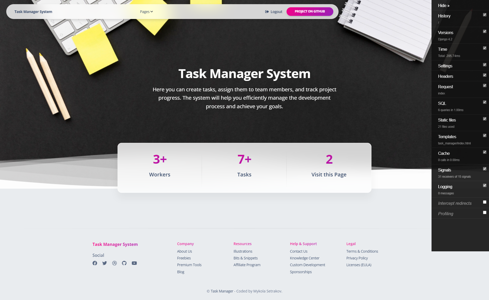

# IT Company Task Manager
Task Manager, which will handle all possible problems during product development in team.

## Check it out
[Task Manager project deployed to Render](https://it-company-task-manager-8aez.onrender.com/)
## Installation
Python3 must be already installed

```shell
git clone https://github.com/nicksetrakov/IT-Company-Task-Manager
cd IT-Company-Task-Manager
python3 -m venv venv
source venv/bin/activate
pip install -r requirements.txt
python manage.py runserver_plus --cert-file certificate.crt --key-file key.key
```
## Features
* 
*  Everyone from the team can create Task, assign this Task to team-members, and mark the Task as done (of course, better before the deadlines).
* For each worker, it is shown separately: completed and not completed tasks.
* Add Tags (like landing-page-layout or python-refactoring) for tasks.
* Social authentication with Google.
* Confirm registration by email. (Realized by Activate token)
* After first authentication, redirect to create profile form. (Implemented middleware that allows access to other pages if the user has a profile.)
* Synchronized the user's Google calendar and tasks on the site.

## Demo


